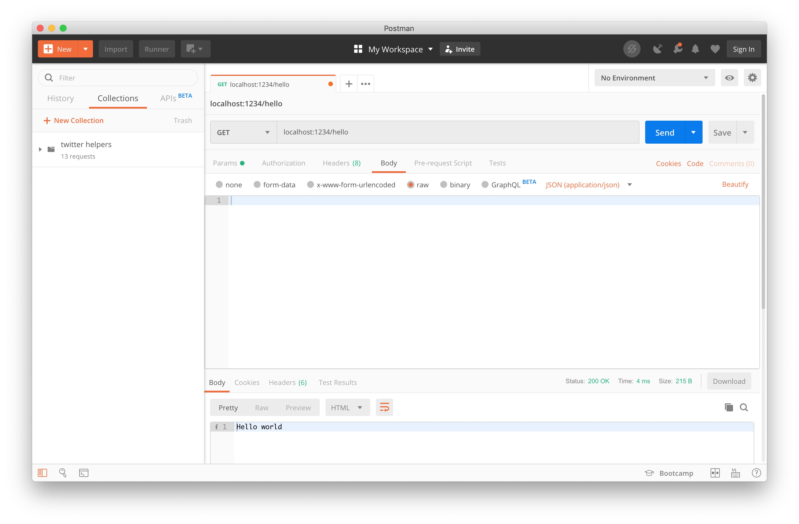

This tutorial aims to show you how to use the Express framework and Node.js to get a simple server up and running completely from scratch. It goes into depth on different ways to test your server without needing to write a front-end.

## Understanding the Terms

It is far too easy to just copy-paste some code examples to get something running without ever really knowing what the code is doing.
To prevent that, I am going to briefly define a few important terms and concepts to potentially help fill some conceptual gaps.

- **REST or RESTful Architecture**: REpresentational State Transfer or REST is a standardized way to design a code base for easy communication between a client and server.
- **Client**: Sends requests (think GET, POST, and DELETE for example) to the server. The client is often confused with the "front end" of an application, but there are distinct differences. *Anything* that sends requests is a client and that includes a server, bash script, a website.
- **Server**: Responds to requests from a client. A response can be many things, but the most common response from an API is a JSON file.
- **JSON**: JavaScript Object Notation is a standard way of formatting data that uses syntax from JavaScript.
- **API (Application Programming Interface)**: Code that allows a client to interact with a server.

As you go through this tutorial, you will see more practical examples of these terms.

## Requirements

For this tutorial you will need a Unix shell to run the bash commands. On Mac and Linux you can use Terminal to run the commands with no problems. On Windows, you will want to use either [Git Bash](https://gitforwindows.org/), [Linux for Windows](https://itsfoss.com/install-bash-on-windows/), [Cmder](https://cmder.net/), or some other Unix shell.

You will also need to have [Node](https://nodejs.org/en/download/package-manager/) and [npm](https://www.npmjs.com/get-npm) installed.

To check if you have Node installed, open your terminal and run:

```bash
node -v
```

To check if you have npm installed, open your terminal and run:

```bash
npm -v
```

With that out of the way, you can set up the project!

## Set up your project

To get started, create and change into a folder for your project.

```bash
mkdir express-tutorial && cd $_
```

Here we used `$_` which is an alias for the input of the last command. The input for the `mkdir` command is `express-tutorial`, so `cd $_` translates to `cd express-tutorial`.

**Pro-tip:** I am using `git` for version control with my folder, so I also did a `git init` at this point. For the sake of simplicity, I'm going to leave `git` out of this tutorial, but in an actual project now is is a good time to start tracking your changes.

From here we want to create a `package.json` file that will keep track of our project dependencies and allow us to do some cool things later on. To do that run:

```bash
npm init -y
```

This will create a `package.json` file and answer "yes" to all the questions because of the `-y` flag.

If you check out your `package.json` file, it should look similar to this:

```json
{
  "name": "express-tutorial",
  "version": "1.0.0",
  "description": "",
  "main": "index.js",
  "scripts": {
    "test": "echo \"Error: no test specified\" && exit 1"
  },
  "keywords": [],
  "author": "Kyrell Dixon",
  "license": "MIT"
}
```

If your `package.json` is not exactly the same, that is perfectly fine. You can add in the fields you want to make it match, but I will point out which fields you need to look out for as this file changes.

The last thing we need to get set up for now is adding in the Express framework. Express is the Node.js framework we will use to create the actual API endpoints, so we will need to install that package. To do that use:

```bash
npm i express
```

Here `npm i` is short for `npm install` because the less letters you type, the less of a risk for carpal tunnel (and because the best developers are lazy).

Running this command will add a few new files:

```bash
.
├── node_modules #new
├── package-lock.json #new
└── package.json
```

**Pro-tip**: To get this to display I used a command called `tree`. [This](https://askubuntu.com/questions/431251/how-to-print-the-directory-tree-in-terminal) link will help you install it on MacOS and Ubuntu.

The `node_modules` folder is where the Express framework code lives as well as all its dependencies. If you're using git, you want to make sure that you **never** commit this folder unless absolutely necessary because it is *massive*.

**Pro-tip:** Check out [`npkill`](https://medium.com/better-programming/npkill-the-easy-solution-to-deleting-node-modules-with-style-1c591126f7a5) if you want a way of easily removing node_modules from unused projects on your computer.

The `package-lock.json` file is automatically generated primarily as a way of keeping track of your project dependencies, but it serves multiple purposes. For more information, check out the npm documentation's [description of this file](https://docs.npmjs.com/files/package-lock.json).

With that, we have all the initial setup done. for the project. Now we can get into creating the server.

## Creating the Initial Server

First we want to create a file to store our main server code:

```bash
touch index.js
```

It is pretty standard to use an `index.js` as the root file since this communicates to other developers that this is where your application starts from.

However, if this is just a personal project that only you will see, feel free to have fun and name it what you want. It does not actually matter what you call the file.

From here you want to take whatever you name the file and type out:

```javascript
const express = require("express");

const app = express();

app.listen(1234, () => {
  console.log("Server is listening on port: 1234");
});
```

So what's going on here?

Line 1 takes care of importing the express package that you installed earlier into your server file.

Line 3 calls the express function which returns an express application.

Lines 5-7 tells your application to listen for any requests that come in on port 1234. For now you can think of a port as a more specific address for a url similar to a street number.

To test out the code, go back to the command line and run:

```bash
node index.js # or node your-filename.js
```

If you've followed every step until now, you should see a message in your terminal saying:

```bash
Server is listening on port: 1234
```

If you don't, try to debug it! If you're getting some type of error message, try to decipher it yourself or just copy and paste it straight into Google.

If all else fails, reach out and I or someone else in the community will gladly help.

Once everything is working, you are almost ready to create some API endpoints! Well, *almost* ready. First we want to do a quick refactoring of the port.

## A Quick Refactor of the `PORT`

As a quick refactoring, we're going to move the port to it's own variable like so:

```javascript {3,6}
const express = require("express");

const PORT = 1234;
const app = express();

app.listen(PORT, () => {
  console.log(`Server is listening on port: ${PORT}`);
});
```

This gets rid of what developers call a "magic number." A magic number is simply a number without a label. In this case, if we didn't explicitly save `1234` in the `PORT` constant, anyone reading the code would have no idea what that number was there for.

Another subtle benefit is that we can now reuse the PORT variable in the `console.log` so that if we change the PORT, we only have to change it in one place.

Simple refactors like this help you have clean code that is easy to understand and work with.

With that out of the way, we can get into creating the API endpoints.

## Creating REST API Endpoints

The first endpoint we'll create will handle a GET request.

```js {6-8}
const express = require("express");

const PORT = 1234;
const app = express();

app.get("/hello", (req, res) => {
  res.send("Hello world");
});

app.listen(PORT, () => {
 console.log(`Server is listening on port: ${PORT}`);
});
```

Let's break this down.

First we have `app.get("/hello", ...)` which tells the server that we want to be able to handle a GET request to the `/hello` endpoint.

Following the endpoint is `(req, res) => {...}` which is an ES6 [arrow function](https://developer.mozilla.org/en-US/docs/Web/JavaScript/Reference/Functions/Arrow_functions) that takes two parameters `req` and `res`.

The first parameter `req` is a variable that stores all the information for the incoming `req`uest from the client. The server `res`ponse functions are stored in the `res` parameter.

In this case we are using `res.send` to respond with the string `"Hello world"`.

So after getting the server up and running how do you test it out? I'm going to cover three ways to test out the api endpoint without having to write a line of code.

## Three ways to test API endpoints

To test out the `"/hello"` endpoint, we want to send a GET request to the full server url at `localhost:1234/hello`.

We are using `localhost` since we are running the server locally and `:1234` since that is the port the server is listening on.

The first way to test this out will be in the browser!

### Testing a GET endpoint from the browser

Pop open Chrome, Firefox, Safari, or whatever browser you're comfortable with. Just please, **PLEASE** don't use Internet Explorer. Microsoft, it's creator, [doesn't even want you to](https://www.theverge.com/2019/2/8/18216767/microsoft-internet-explorer-warning-compatibility-solution).

If you're getting an error, make sure to restart your server with `ctrl+c` followed by a `node index.js`. (I'll show you a way to avoid errors from forgetting to restart your server a little later.)

Your browser should look like:


Why does this work?

Whenever you go to the address bar in your browser, it is actually doing a GET request to whatever URL you give it. So every time you go to google.com for example, your browser is doing a GET and the Google server is sending you the HTML, CSS, and JavaScript needed to display the Google search bar.

The GET route for the `"hello"` endpoint is currently sending down the string `"Hello world"`, but we could have it send pretty much any document containing text--which is all a JSON or HTML file really is.

A browser is great for quickly testing our GET endpoints, but if you need to test any other type of request like a POST or DELETE, you will need a different method entirely. This next method will show you how to test your endpoints entirely from the command line using cURL.

### Test any API endpoints from the command line with cURL

Sometimes you want to quickly test your API endpoint without having to leave your code editor. If you are working with Visual Studio Code, then you can test your API endpoints without needing to open up another app. (If not, you can open up the terminal and still take advantage of this method.)

**Pro-tip:** Use Visual Studio Code. It's the best.

To test your endpoints with cURL, go to your command line and type:

```bash
curl localhost:1234/hello
```

You should get the same `"Hello world"` response that you got from the browser.

With cURL you can also do other types of requests like POST, PUT, and DELETE, modify headers, use cookies, and pretty much anything else you need to test out an API. It's a very powerful tool to learn, but if you're not a fan of working with a command line it can get tedious.

This is where the final solution comes in.

### Testing your API endpoints with Postman



[Postman](https://www.getpostman.com/) provides a nice GUI (pronounced "gooey"), or Graphical User Interface, to easily make requests to your endpoints. I personally use this most out of the techniques mentioned because it just makes APIs so easy to test. It is especially useful as your APIs grow in complexity and you have a wide variety of endpoints to test.

In this case, all you need to do is pass in the url as shown in the image above and hit send. The `"Hello world` response shows up like normal, but you can also see the headers that get sent back with the response.


You can think of headers as simply data about a request or response. In the image you can see an `X-Powered-By: Express` header that tells you Express is responsible for sending this response.

Another notable header is the `Content-Type` header that lets the client know how to interpret the body of the response. Here it is `text/html; charset=utf-8` since that is the default `Content-Type` when using `res.send` for the response.

There are several other default headers that Postman parses out and makes it easy to see, but in each of the techniques, the exact same headers and response body were sent. This just shows that using different tools have various pros and cons, and sometimes you can learn just by trying different ways to accomplish the same task.

Now that testing is out of the way, I want to show an optional way to prevent a common mistake you will inevitably run into in your career.

## Bonus: Reduce development errors with `nodemon`

Anytime you make changes to your server you have to stop and restart the server to be able to test those changes. Forgetting to restart the server can lead to hours of frustration and doubt because you think your code isn't working when in reality the server just hasn't loaded the changes.

If you haven't felt this struggle you are one of the lucky few. This tip will make it so you never encounter it. The solution is to install an npm package called `nodemon`.

With `nodemon`, you will never have to manually restart your server. It runs in the background and watches all your files for changes. When it detects one, it will automatically restart the server so you can focus on writing code.

To get started you will need to install it:

```bash
npm i --save-dev nodemon
```

Here you use the `--save-dev` or alternatively the `-D` flag to add nodemon to you `devDependencies` in the `package.json` file.

Your `package.json` file should now contain an object similar to this:

```json
{
  "devDependencies": {
    "nodemon": "^1.19.1"
  }
}
```

We added it to the `devDependencies` since this is just a convenient way to run the server to make development easier and isn't required to have a working application.

To use `nodemon` to run the server, first you want to add a `"start"` script to the `package.json` in the `"scripts"` object:

```json
"scripts": {
  "start": "nodemon index.js",
  "test": "echo \"Error: no test specified\" && exit 1"
},
```

Then to run the server you can use:

```bash
npm start
```

This should create a display that looks like:


Another way to work with `nodemon` is to do a global install that will allow you to run it from the command line for *any* project without needing to install it as a `devDependency`.

To do that run:

```bash
npm i -g nodemon
```

This installs the package system-wide instead of just for the specific project. This allows you to simply run `nodemon index.js` from the command line without having to set up a script in the `package.json` file.

## Finishing up

This tutorial has covered the inital set up of an Express server, creating a GET endpoint, and testing the endpoint with `cURL`, a browser, and Postman.

You should now have everything you need to explore and test other types of endpoints. With that, I'll leave you with a few practical exercises for those that want to go beyond what this tutorial has shown.

### Exercises

- Push your code to GitHub
- Add POST, PUT, and DELETE endpoints to the server
- Read through the Express.js [documentation](https://expressjs.com/en/api.html)
- Create a simple form and connect it to the server
- Deploy the server on [DigitalOcean](https://www.digitalocean.com/) or a serverless cloud provider

If you have any questions or feedback, reach out to me on [Twitter](https://www.twitter.com/kyrelldixon)!
