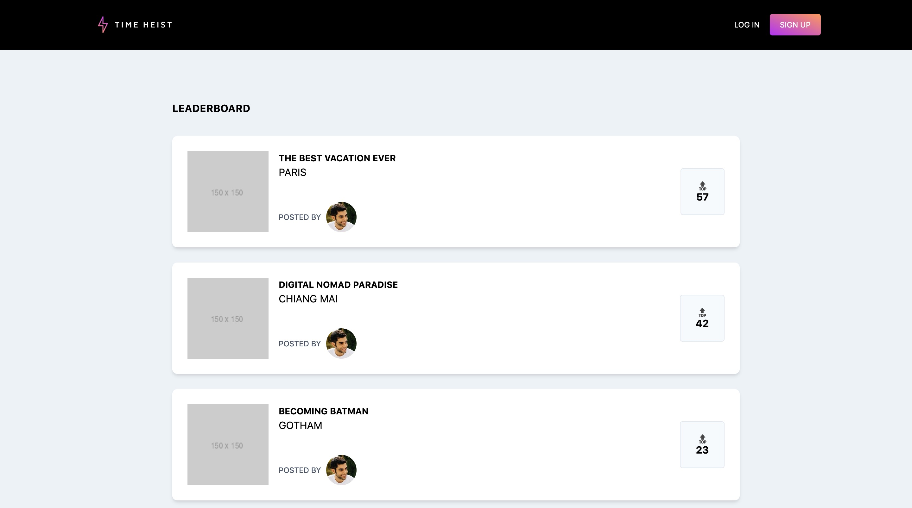

## Who is this post for

This post aims to be as beginner-friendly as possible, but to get the most out of it, you should have experience working with Javascript fundamentals like objects, functions, arrays, conditionals, etc.

I include links to helpful resources that will go more into depth on specific concepts since this is more of a deep dive into the steps I took and the logic behind those decisions.

## What will you be making



I've been getting a lot of questions on how to build a full stack Vue.js application using Vuex, Vue Router, and Firebase complete with authentication, so I decided to make one. Time Heist is a Product Hunt clone where users can upload trips instead of products.

This post walks through some fundamental Vue concepts like list rendering, computed properties, and props and how they can be used to build the leaderboard page of Time Heist. The final version is a dynamically rendered list of trips sorted by likes/upvotes.

Users will also be able to upvote trips as many times as they like, but this will eventually be limited to a single vote per trip.

You can view the finished project [here](https://ph-leaderboard.netlify.com/).

## Why Tailwind and Vue.js

Since no application is complete without styling, I decided to use Tailwind CSS. [Tailwind](https://tailwindcss.com/) is a "utility-first CSS framework," that allows you to create a completely custom design unlike other popular CSS frameworks like Bootstrap and Material UI.

I decided to use Tailwind since I will be working with a custom design built in Sketch. Tailwind is a great CSS framework if you're working with a designer because it allows you to easily integrate your color scheme and customize the Tailwind config to extend the functionality.

I am also using Vue.js because it is a very beginner-friendly Javascript framework relative to React.js and Angular. I considered using Svelte, but Vue.js has been out a bit longer so it has better documentation and is more widely used.

## Getting started

Before getting started, I have to give credit to [Danny Minutillo](https://twitter.com/danny_minutillo) for creating the design and concept for Time Heist.

This post assumes you are using the [`yarn` package manager](https://yarnpkg.com/lang/en/), but all of the commands used can be replaced with the equivalent `npm` commands.

And of course, you will need `Node` to be able to run the app locally.

## Create the project

This project was bootstrapped using the latest [`Vue CLI`](https://cli.vuejs.org/) package. To install it, go to a bash shell and run:

```bash
yarn global add @vue/cli # or npm i -g @vue/cli
```

From there you can create the project with the Vue CLI by running:

```bash
vue create time-heist
```

This will open up a prompt asking you to pick a preset. This project uses the default settings, so hit enter after running the above command.

After setting up the default project, change directories and run it. You can do that with:

```bash
cd time-heist
yarn serve # or npm run serve
```

This will create a project named `time-heist` and automatically add it to version control. I used Git throughout the project, and it would be a good idea for you as well.

After creating the project, there are a few setup steps before getting into the code.

## Setting up the project

### Optionally add start script

For convenience, I added a start script to the `package.json` file so I could use my yarn alias, `ys`, to start the project.

This is an optional step since you can use `yarn serve` to run the project without adding the additional script. If you want to have the same setup, replace your `scripts` object with the one below.

```json
"scripts": {
   "start": "vue-cli-service serve",
   "serve": "vue-cli-service serve",
   "build": "vue-cli-service build",
   "lint": "vue-cli-service lint"
},
```

### Remove project boilerplate

Remove the extra assets including the `HelloWorld.vue` component, all the styling, the logo, and pretty much anything inside of App.vue. The directory structure should look like the one below after you are finished.

```bash
.
├── README.md
├── babel.config.js
├── package.json
├── public
│   ├── favicon.ico
│   └── index.html
├── src
│   ├── App.vue
│   └── main.js
└── yarn.lock
```

The only thing left in the `App.vue` component is an `h1` and a `template` tag just to ensure the styling is getting added correctly when Tailwind is imported.

`App.vue`

```html
<template>
  <h1>App.vue</h1>
</template>
```

### Adding Tailwind CSS

One of the few drawbacks of using Tailwind is that at first requires some setup (which can be confusing). Setting it up optimally deserves its own post, but for the sake of this post, I added the steps I used to set up Tailwind with Vue.

First, install the library:

```bash
yarn add tailwindcss # or npm i tailwindcss
```

From there you want to create a directory to keep the css files. Create a `styles` folder in `assets` and then add a `tailwind.css` file to it.

```bash
mkdir src/assets/styles
touch src/assets/styles/tailwind.css
```

Now you can add the Tailwind CSS imports to the file to have access to all the utility classes.

`tailwind.css`

```css
@tailwind base;
@tailwind components;
@tailwind utilities;
```

Import `tailwind.css` into `main.js` to include it in the Vue app. You can also add it to the `App.vue` file, but it's important to make sure that it's available to all the components. Adding to `main.js` will always work since this is the root of the Vue app.

```javascript
// main.js

// ...other imports

import './assets/styles/tailwind.css'
```

The tailwind styles require a build step, so to set that up you need to configure PostCSS to look for the tailwind files. First, create the PostCSS config in the root of the project with:

```bash
touch postcss.config.js
```

Now you can add `tailwindcss` and `autoprefixer` to `postcss.config.js`.

```js
// postcss.config.js

module.exports = {
  plugins: [
    require('tailwindcss'),
    require('autoprefixer'),
  ]
}
```

The Vue CLI automatically installs and configures PostCSS in the `package.json` file, so you want to delete it so it won't conflict with the PostCSS config file.

Remove the entire block in the `package.json` file containing the code block below.

```js
  "postcss": {
    "plugins": {
      "autoprefixer": {}
    }
  },
```

The `package.json` file should now look like:

```json
{
  "name": "time-heist",
  "version": "0.1.0",
  "private": true,
  "scripts": {
    "start": "vue-cli-service serve",
    "serve": "vue-cli-service serve",
    "build": "vue-cli-service build",
    "lint": "vue-cli-service lint"
  },
  "dependencies": {
    "core-js": "^2.6.5",
    "tailwindcss": "^1.1.2",
    "vue": "^2.6.10"
  },
  "devDependencies": {
    "@vue/cli-plugin-babel": "^3.11.0",
    "@vue/cli-plugin-eslint": "^3.11.0",
    "@vue/cli-service": "^3.11.0",
    "babel-eslint": "^10.0.1",
    "eslint": "^5.16.0",
    "eslint-plugin-vue": "^5.0.0",
    "vue-template-compiler": "^2.6.10"
  },
  "eslintConfig": {
    "root": true,
    "env": {
      "node": true
    },
    "extends": [
      "plugin:vue/essential",
      "eslint:recommended"
    ],
    "rules": {},
    "parserOptions": {
      "parser": "babel-eslint"
    }
  },
  "browserslist": [
    "> 1%",
    "last 2 versions"
  ]
}
```

If it doesn't, you can replace the contents with the text above, delete your `node_modules` and `yarn.lock` files, and run `yarn` to ensure you have the same setup.

The last step for configuring Tailwind is to create the `tailwind.config.js` file in the root folder of the project. To create it run:

```bash
npx tailwind init
```

This will create the file with some boilerplate tailwind config info.

`tailwind.config.js`

```js
module.exports = {
  theme: {
    extend: {}
  },
  variants: {},
  plugins: []
}
```

There isn't anything to add to it now, but this file can be configured to add or remove functionality from Tailwind.

With that out of the way, you are now ready to create the Leaderboard page!

## Creating the Leaderboard Page

### Just add HTML

If you're comfortable working with HTML and CSS, then this part will be fun. I had the designs open as I styled the app, but feel free to reach out to me on [Twitter](https://twitter.com/kyrelldixon) for the design. You can also just reference the [finished app](https://ph-leaderboard.netlify.com/).

There's not much that needs to be broken down in this section since it is just HTML and CSS. If you are curious what any specific class is doing, just copy the class and search it in the Tailwind [docs](https://tailwindcss.com/docs/installation/).

Below is my initial `App.vue` file complete with the navbar and a single Leaderboard card.

```html
<template>
  <div class="bg-gray-200 h-screen">
    <nav class="bg-black text-white flex justify-between items-center px-4 md:px-8 py-4">
      <p class="uppercase tracking-widest">Time Heist</p>
      <div>
        <button class="uppercase text-xs">Log In</button>
        <button class="uppercase text-xs px-4 py-2 bg-gradient rounded ml-4">Sign Up</button>
      </div>
    </nav>

    <section>
      <div class="mx-4 lg:mx-auto mt-20 max-w-4xl">
        <h1 class="font-bold uppercase tracking-wide mb-8">Leaderboard</h1>
          <article class="flex justify-between items-center bg-white rounded p-6 uppercase">
            <div class="flex">
              
              <div class="flex flex-col justify-between ml-4">
                <div class="mb-4">
                  <p class="font-bold text-sm">Title</p>
                  <p>City</p>
                </div>
                <div class="flex items-center">
                  <span class="text-xs text-gray-700 mr-2">Posted by</span>
                  
                </div>
              </div>
            </div>
            <button class="font-bold flex flex-col py-4 px-8 bg-gray-100 border border-gray-300 rounded">
              <span role="img" aria-label="up arrow">🔝</span>
              <span>23</span>
            </button>
          </article>
      </div>
    </section>
  </div>
</template>

<style scoped>
  .bg-gradient {
    background: linear-gradient(to top right,#af35f1, #fa9a5e);
  }
</style>
```

I only needed to create one class to add a custom gradient for the button backgrounds. Everything else is completely Tailwind.

I used [Placeholder.com](https://placeholder.com/) as thumbnails for the Trip image and [Randomuser.me](https://randomuser.me/) to get a profile picture. Later these will be replaced by actual images.

Currently the `App.vue` component is getting a bit bloated, so it's time for a refactor!

### Refactor from app to components

The two main components that are good candidates for an initial refactor, the navbar and the leaderboard card.

To refactor these components make two new files called `LeaderboardCard.vue` and `Navbar.vue` in a `components` directory. You can simply add them with your text editor or IDE, or run the commands below:

```bash
mkdir src/components; cd $_
touch LeaderboardCard.vue Navbar.vue
```

From here it's just a matter of cutting and pasting from `App.vue` into each of the separate files and importing them back into the `App` component. Your files should look like:

`App.vue`

```html
<template>
  <div class="bg-gray-200 h-screen">
    <navbar />
    <section>
      <div class="mx-4 lg:mx-auto mt-20 max-w-4xl">
        <h1 class="font-bold uppercase tracking-wide mb-8">Leaderboard</h1>
        <leaderboard-card />
      </div>
    </section>
  </div>
</template>

<script>
import Navbar from './components/Navbar'
import LeaderboardCard from './components/LeaderboardCard'

export default {
  components: {
    'navbar': Navbar,
    'leaderboard-card': LeaderboardCard,
  }
}
</script>
```

`LeaderboardCard.vue`

```html
<template>
  <article class="flex justify-between items-center bg-white rounded p-6 uppercase mb-6">
    <div class="flex">
      
      <div class="flex flex-col justify-between ml-4">
        <div class="mb-4">
          <p class="font-bold text-sm">Title</p>
          <p>City</p>
        </div>
        <div class="flex items-center">
          <span class="text-xs text-gray-700 mr-2">Posted by</span>
          
        </div>
      </div>
    </div>
    <button class="font-bold flex flex-col py-4 px-8 bg-gray-100 border border-gray-300 rounded">
      <span role="img" aria-label="up arrow">🔝</span>
      <span>23</span>
    </button>
  </article>
</template>
```

`Navbar.vue`

```html
<template>
  <nav class="bg-black text-white flex justify-between items-center px-4 md:px-8 py-4">
      <p class="uppercase tracking-widest">Time Heist</p>
      <div>
        <button class="uppercase text-xs">Log In</button>
        <button class="uppercase text-xs px-4 py-2 bg-gradient rounded ml-4">Sign Up</button>
      </div>
    </nav>
</template>

<style scoped>
  .bg-gradient {
    background: linear-gradient(to top right,#af35f1, #fa9a5e);
  }
</style>
```

The components also had to be registered to the `App.vue` so they could be added as tags in the template.

The nice thing about having separate components is that it makes it easy to duplicate a card to simulate having multiple trips. Duplicate the `leaderboard-card` tag a few times so you have an `App.vue` template that looks like:

```html {8-9}
<template>
  <div class="bg-gray-200 h-screen">
    <navbar />
    <section>
      <div class="mx-4 lg:mx-auto mt-20 max-w-4xl">
        <h1 class="font-bold uppercase tracking-wide mb-8">Leaderboard</h1>
        <leaderboard-card />
        <leaderboard-card />
        <leaderboard-card />
      </div>
    </section>
  </div>
</template>
```

Currently, all the data in the leaderboard cards is hard-coded. To make it more dynamic, we'll use [Vue Props](https://vuejs.org/v2/guide/components-props.html).

### Adding dynamic data to a component with props

Before you can add props, you have to decide what data you want to pass in dynamically. In this case, the trip **title**, **city**, and **likes** are all good candidates.

To add props to the cards, you create an attribute the same way you add a `class` to a tag by passing the name of the prop followed by a string containing the prop value.

I added some fake trip data so my trips so the template of the `App.vue` component now looks like:

```html {7-9}
<template>
  <div class="bg-gray-200 h-screen">
    <navbar />
    <section>
      <div class="mx-4 lg:mx-auto mt-20 max-w-4xl">
        <h1 class="font-bold uppercase tracking-wide mb-8">Leaderboard</h1>
        <leaderboard-card title="The Best Vacation Ever" city="Paris" likes="57" />
        <leaderboard-card title="Digital Nomad Paradise" city="Chiang Mai" likes="42"  />
        <leaderboard-card title="Becoming Batman" city="Gotham" likes="23"  />
      </div>
    </section>
  </div>
</template>
```

By itself, this won't change anything. You also have to update the `LeaderboardCard.vue` file. There are two main steps when adding props to a child component:

1. Add a props key with an array or object containing the props,
2. and Add the prop to the template in double curly brackets

You can see this in the `LeaderboardCard.vue` file:

```html
<template>
  <article class="flex justify-between items-center bg-white rounded p-6 uppercase mb-6">
    <div class="flex">
      
      <div class="flex flex-col justify-between ml-4">
        <div class="mb-4">
          <p class="font-bold text-sm">{{ title }}</p>
          <p>{{ city }}</p>
        </div>
        <div class="flex items-center">
          <span class="text-xs text-gray-700 mr-2">Posted by</span>
          
        </div>
      </div>
    </div>
    <button class="font-bold flex flex-col py-4 px-8 bg-gray-100 border border-gray-300 rounded">
      <span role="img" aria-label="up arrow">🔝</span>
      <span>{{ likes }}</span>
    </button>
  </article>
</template>

<script>
export default {
  props: [
    "title",
    "city",
    "likes",
  ]
}
</script>
```

If you want to quickly add the props to test functionality, adding them in an array is a gray way to get them working. An even better way to use props and a Vue best practice is to use prop types.

### Adding prop types

Vue Prop Types will cause warnings to display in the console when the type of a value is invalid. This can help you catch errors early on in the development process.

The Vue props [documentation](https://vuejs.org/v2/guide/components-props.html) shows a full list of all the available prop types that can be used.

In this case, the **title** and **city** should both be a **String**, and the **likes** should be the **Number** type.

To add in types, you change props to an object where the keys are the name of the props, and the values are the prop types.

`LeaderboardCard.vue`

```html
<script>
export default {
  props: {
    title: String,
    city: String,
    likes: Number,
  }
}
</script>
```

Another best practice with prop types is to set either a **default** value *or* a **required** flag. You should only add one or the other since you don't need a default value if one should always be passed in.

For this example, the props should all be **required**. The `script` tag for `LeaderboardCard.vue` should now look like:

```html
<script>
export default {
  props: {
    title: {
      type: String,
      required: true,
    },
    city: {
      type: String,
      required: true,
    },
    likes: {
      type: Number,
      required: true,
    },
  }
}
</script>
```

If you check the console, you may notice that it is now throwing warnings for the `likes` prop. This is because the `App.vue` component is passing a **String** type to the `likes` prop instead of a **Number**.

It may look like a number is being passed in, but HTML attributes are always passed in as a string. To fix the error, the `leaderboard-card` tags in `App.vue` will have to be modified.

You can use the `v-bind` syntax to correctly pass data to the `likes` prop. To fix the error change `likes="23"` to `:likes="23"`. Adding the ":" to the likes prop is short-hand for `v-bind:likes`.

When a value is bound, Vue changes the data passed into the prop into it's Javascript equivalent. In this case, `"23"` becomes the number `23`. If we still wanted to pass a string, you could do so with `:likes="'23'"`.

Now that the data is being dynamically passed in with props, we can remove some of the code duplication and dynamically render the list of trips.

### Dynamically rendering lists with `v-for`

To render the list dynamically, we'll need some data to add to each component. I extracted the data that was being passed into each component individually into a `trips` array by passing it to `data` in a function as shown below.

`App.vue`

```html
<script>
import Navbar from './components/Navbar'
import LeaderboardCard from './components/LeaderboardCard'

export default {
  components: {
    'navbar': Navbar,
    'leaderboard-card': LeaderboardCard,
  },
  data: function() {
    return {
      trips: [
        {
          title: "The Best Vacation Ever",
          city: "Paris",
          likes: 57,
        },
        {
          title: "Digital Nomad Paradise",
          city: "Chiang Mai",
          likes: 42,
        },
        {
          title: "Becoming Batman",
          city: "Gotham",
          likes: 23,
        },
      ],
    }
  },
}
</script>
```

To iterate over the array and display it correctly, `v-for` is used on the leaderboard card like below.

```html
<template>
  <div class="bg-gray-200 h-screen">
    <navbar />
    <section>
      <div class="mx-4 lg:mx-auto mt-20 max-w-4xl">
        <h1 class="font-bold uppercase tracking-wide mb-8">Leaderboard</h1>
        <leaderboard-card
          v-for="trip in trips"
          :key="trip.title"
          :title="trip.title"
          :city="trip.city"
          :likes="trip.likes"
        />
      </div>
    </section>
  </div>
</template>
```

Let's break this down.

The `v-for` attribute is used in the tag you want to repeat, so here it is passed into the `leaderboard-card` tag. The value of the `v-for` is `trip in trips` since we want to loop through the `trips` array that was added to `data`.

On each iteration of the loop, a `trip` object is extracted and used to pass in data to each prop. The `:title` and `:city` attributes are passed `trip.title` and `trip.city` respectively so that the trip values can be correctly passed in.

The new `:key` prop is required to be a unique value so Vue can tell each component apart when using a `v-for` loop. The trip title is functioning as the key currently since there are only a few items and it is easy to verify they are unique.

In an actual application, this ID would come from the database or API that is in use. To simulate that, we can add an id to each trip object in the `trips` array.

To make this work a little more nicely, add an ID to each trip in the trips array and pass the whole trip as a prop. The files should now look like:

`App.vue`

```html
<template>
  <div class="bg-gray-200 h-screen">
    <navbar />
    <section>
      <div class="mx-4 lg:mx-auto mt-20 max-w-4xl">
        <h1 class="font-bold uppercase tracking-wide mb-8">Leaderboard</h1>
        <leaderboard-card
          v-for="trip in trips"
          :key="trip.id"
          :title="trip.title"
          :city="trip.city"
          :likes="trip.likes"
        />
      </div>
    </section>
  </div>
</template>
```

Extracting out each trips data in the for loop isn't necessary since the entire trip object could be passed to the leaderboard card as a prop. After this final refactor, the files should look like:

`App.vue`

```html
<template>
  <div class="bg-gray-200 h-screen">
    <navbar />
    <section>
      <div class="mx-4 lg:mx-auto mt-20 max-w-4xl">
        <h1 class="font-bold uppercase tracking-wide mb-8">Leaderboard</h1>
        <leaderboard-card
          v-for="trip in trips"
          :key="trip.id"
          :trip="trip"
        />
      </div>
    </section>
  </div>
</template>

<script>
import Navbar from './components/Navbar'
import LeaderboardCard from './components/LeaderboardCard'

export default {
  components: {
    'navbar': Navbar,
    'leaderboard-card': LeaderboardCard,
  },
  data: function() {
    return {
      trips: [
        {
          id: 1,
          title: "The Best Vacation Ever",
          city: "Paris",
          likes: 57,
        },
        {
          id: 2,
          title: "Digital Nomad Paradise",
          city: "Chiang Mai",
          likes: 42,
        },
        {
          id: 3,
          title: "Becoming Batman",
          city: "Gotham",
          likes: 23,
        },
      ],
    }
  },
}
</script>
```

`LeaderboardCard.vue`

```html
<template>
  <article class="flex justify-between items-center bg-white rounded p-6 uppercase mb-6">
    <div class="flex">
      
      <div class="flex flex-col justify-between ml-4">
        <div class="mb-4">
          <p class="font-bold text-sm">{{ trip.title }}</p>
          <p>{{ trip.city }}</p>
        </div>
        <div class="flex items-center">
          <span class="text-xs text-gray-700 mr-2">Posted by</span>
          
        </div>
      </div>
    </div>
    <button class="font-bold flex flex-col py-4 px-8 bg-gray-100 border border-gray-300 rounded">
      <span role="img" aria-label="up arrow">🔝</span>
      <span>{{ trip.likes }}</span>
    </button>
  </article>
</template>

<script>
export default {
  props: {
    trip: {
      type: Object,
      required: true
    }
  },
}
</script>
```

Add that's it! This section covered a lot, so it's okay if it was a little confusing.

The main takeaways here are:

- The `v-for` syntax is used to iterate over the `trips` and create a new `leaderboard-card` tag for each `trip in trips`.
- When using `v-for`, a unique key should also be added as a prop.
- A single `trip` object is a cleaner and more scalable way to pass in trip data than passing each prop individually.

For a more in-depth look into list rendering, you can check out the [Vue docs](https://vuejs.org/v2/guide/list.html).

With that out of the way, it is time to add the ability for users to upvote their favorite trip and make this more of a leaderboard!

### Adding upvote functionality

First, add a new required `upVote` prop with the **Function** type to the props in `LeaderboardCard.vue`.

```html
<script>
export default {
  props: {
    trip: {
      type: Object,
      required: true,
    },
    upVote: {
      type: Function,
      required: true,
    },
  },
}
</script>
```

Now add an `@click` event handler to the upvote button and pass it the `upVote` function. The leaderboard component should now look like:

```html
<template>
  <article class="flex justify-between items-center bg-white rounded p-6 uppercase mb-6">
    <div class="flex">
      
      <div class="flex flex-col justify-between ml-4">
        <div class="mb-4">
          <p class="font-bold text-sm">{{ trip.title }}</p>
          <p>{{ trip.city }}</p>
        </div>
        <div class="flex items-center">
          <span class="text-xs text-gray-700 mr-2">Posted by</span>
          
        </div>
      </div>
    </div>
    <button @click="upVote(trip.id)" class="font-bold flex flex-col py-4 px-8 bg-gray-100 border border-gray-300 rounded">
      <span role="img" aria-label="up arrow">🔝</span>
      <span>{{ trip.likes }}</span>
    </button>
  </article>
</template>
```

The `@click` handler is being assigned `upVote(trip.id)` here so that clicking the button will increment the appropriate trip.

Currently, there is no `upVote` function being passed in as a prop, so let's add it to `App.vue` and pass it in.

`App.vue`

```html
<template>
  <div class="bg-gray-200 h-screen">
    <navbar />
    <section>
      <div class="mx-4 lg:mx-auto mt-20 max-w-4xl">
        <h1 class="font-bold uppercase tracking-wide mb-8">Leaderboard</h1>
        <leaderboard-card
          v-for="trip in trips"
          :key="trip.id"
          :trip="trip"
          :upVote="upVote"
        />
      </div>
    </section>
  </div>
</template>

<script>
import Navbar from './components/Navbar'
import LeaderboardCard from './components/LeaderboardCard'

export default {
  components: {
    'navbar': Navbar,
    'leaderboard-card': LeaderboardCard,
  },
  data: function() {
    return {
      trips: [
        {
          id: 1,
          title: "The Best Vacation Ever",
          city: "Paris",
          likes: 57,
        },
        {
          id: 2,
          title: "Digital Nomad Paradise",
          city: "Chiang Mai",
          likes: 42,
        },
        {
          id: 3,
          title: "Becoming Batman",
          city: "Gotham",
          likes: 23,
        },
      ],
    }
  },
  methods: {
    upVote: function(id) {
      this.trips = this.trips.map(trip => {
        if (trip.id === id) {
          return {
            ...trip,
            likes: trip.likes + 1
          }
        }
        return trip;
      });
    }
  }
}
</script>
```

So what's going on here?

The `leaderboard-card` tag is being passed the new `upVote` function as a prop as shown here:

```html
<leaderboard-card
  v-for="trip in trips"
  :key="trip.id"
  :trip="trip"
  :upVote="upVote"
/>
```

Then you have the `upVote` method itself:

```javascript
methods: {
  upVote: function(id) {
    this.trips = this.trips.map(trip => {
      if (trip.id === id) {
        return {
          ...trip,
          likes: trip.likes + 1
        }
      }
      return trip;
    });
  }
}
```

The first thing to understand is the `.map` part of `this.trips.map`. Mapping comes from the world of functional programming and is simply a way to loop through an array and return a new array with some modification to the values.

In this case the loop is checking if a trips ID matches the ID passed into the function in the `trips.id === id` line. The `id` parameter comes from the currently clicked button.

If the IDs match, then this is the element we want to upvote. To upvote an object, you have to create a brand new object with the likes increased by 1. That is being handled by:

```js
return {
  ...trip,
  likes: trip.likes + 1
}
```

The `...trip` line uses the [spread syntax](https://developer.mozilla.org/en-US/docs/Web/JavaScript/Reference/Operators/Spread_syntax) to copy all of the existing trip values into this new object. This line is essentially the same as saying:

```js
return {
  id: trip.id,
  title: trip.title,
  city: trip.city,
  likes: trip.likes + 1
}
```

So if the IDs match, the trip is replaced. Otherwise, it just returns the original trip unmodified.

When the map finishes, it returns a new trips array with the likes incremented for the trip whose upvote button was clicked. The new array is assigned to `this.trips`.

A summary of the overall flow is:

1. A button is clicked
2. `upvote(trip.id)` is called with `trip.id` being the id for the trip associated with the current button.
3. The trips are looped through with `this.trips.map`
4. The trip with the matching id is replaced with an identical object except the likes are incremented by 1
5. `this.trips` is assigned the updated trips array with the correct trip upvoted.

After that, Vue handles the rest! It notices the change to the array and re-renders the `leaderboard-card` tags.

Now that trips can be upvoted, Vue should automatically sort the trips so the most upvoted trip is on top.

### Sorting trips with computed properties

To sort the trips, add the following code to `App.vue`:

```js
// methods: {
//  ...
//},
computed: {
 sortedTrips: function() {
   return [...this.trips].sort((a, b) => b.likes - a.likes)
 }
},
```

To break down this understandably cryptic syntax, we'll start from the `sortedTrips` key. All values inside of the `computed` object should be functions that return a new object. However, you can think of `sortedTrips` as just the return value of the function. So what exactly *is* being returned here?

Starting at the beginning of the return statement, you'll see `[...this.trips]`. The spread (`...`) operator is being used to extract all the existing values of the `this.trips` array into a new array.

I had to do this because if you try to sort the original `this.trips` array you'll get the error: `error: Unexpected side effect in "sortedTrips" computed property`. This is because `sort` attempts to modify the original trips array instead of returning a new array with all the values sorted. To overcome that, you make a copy of `this.trips` and sort *that* array instead.

To sort the new array, the `.sort` function is being used. Javascript requires you to pass a comparison function to sort so that it knows what to sort by. An ES6 arrow function is being passed as shown by the:

```js
(a, b) => b.likes - a.likes
```

This comparison function is taken straight from the [Mozilla Sort documenation](https://developer.mozilla.org/en-US/docs/Web/JavaScript/Reference/Global_Objects/Array/sort) with a slight modification.

The example used to sort numbers in ascending order is:

```js
let numbers = [4, 2, 5, 1, 3];
numbers.sort((a, b) => a - b);
console.log(numbers);

// [1, 2, 3, 4, 5]
```

I used `b - a` since the values should be sorted in *descending* order with the most liked trips listed first. Since the trips are sorted by likes `b.likes` and `a.likes` are subtracted instead of attempting to subtract the objects with `b - a`.

After sorting the trips, the computed property `sortedTrips` can be used in the for loop. The final `App.vue` value should look like:

```html
<template>
  <div class="bg-gray-200 h-screen">
    <navbar />
    <section>
      <div class="mx-4 lg:mx-auto mt-20 max-w-4xl">
        <h1 class="font-bold uppercase tracking-wide mb-8">Leaderboard</h1>
        <leaderboard-card
          v-for="trip in sortedTrips"
          :key="trip.id"
          :trip="trip"
          :upVote="upVote"
        />
      </div>
    </section>
  </div>
</template>

<script>
import Navbar from './components/Navbar'
import LeaderboardCard from './components/LeaderboardCard'

export default {
  components: {
    'navbar': Navbar,
    'leaderboard-card': LeaderboardCard,
  },
  data: function() {
    return {
      trips: [
        {
          id: 2,
          title: "Digital Nomad Paradise",
          city: "Chiang Mai",
          likes: 42,
        },
        {
          id: 1,
          title: "The Best Vacation Ever",
          city: "Paris",
          likes: 57,
        },
        {
          id: 3,
          title: "Becoming Batman",
          city: "Gotham",
          likes: 23,
        },
      ],
    }
  },
  computed: {
    sortedTrips: function() {
      return [...this.trips].sort((a, b) => b.likes - a.likes)
    }
  },
  methods: {
    upVote: function(id) {
      this.trips = this.trips.map(trip => {
        if (trip.id === id) {
          return {
            ...trip,
            likes: trip.likes + 1
          }
        }
        return trip;
      });
    }
  }
}
</script>
```

After the trips are sorted, Vue will now automatically sort the array whenever a trip has more likes than another and move it up the list.

With that finished, the Time Heist leaderboard is finished!

## Finishing up and next steps

If you've been adding your code to git, it should be easy to push to deploy it to Netlify in less than 5 minutes. Mine can be found [here](https://ph-leaderboard.netlify.com/).

I went back and added a few more styles, so if you want to see the full repo, check out the [leaderboard branch](https://github.com/kyrelldixon/time-heist/tree/leaderboard) of the [repo](https://github.com/kyrelldixon/time-heist).

The next steps are to add the rest of the pages for signing up, logging in, uploading trips, trip details, and a landing page to keep it all together.

If you have any questions or feedback, feel free to reach out to me on [Twitter](https://twitter.com/kyrelldixon)!
