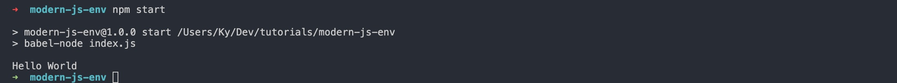

This tutorial will show you how to create a JavaScript project that will allow you to take advantage
of the many new language features of JavaScript. It also serves as a base project for any back-end projects
or scripts that you create in the future.

## Prerequisites

To get through the tutorial you need:
* Node.js
* npm
* A bash shell or terminal.

If you're a Windows user then you can a tool like [cmder](https://cmder.net/)
or even better: [set up your Node.js development environment with WSL 2](https://docs.microsoft.com/en-us/windows/nodejs/setup-on-wsl2).
With that out of the way, let's hop into the tutorial!

## Create a new npm project

To get started, you'll need to create a new folder in a place that's easy to remember. I have a `Dev` folder that I like to keep
all my projects, but you can put it anywhere. After navigating to a folder, make a new directory to keep the project.

```bash
mkdir modern-js-env
cd modern-js-env
```

After making a new directory and running `cd` to change into it, initialize the folder as an `npm` package.
You can use the `-y` flag to create it with all default values, or you can leave it off and follow the prompts to manually
set the appropriate values. I will run:

```bash
npm init -y
```

Running this script creates a `package.json` that organizes the metadata, scripts, and dependencies for the project.
Later in the tutorial, we will configure the `package.json` file more, but first, you want to install the libraries that make up the core of the development environment.

## Set Up Babel

Babel is a very powerful tool that has completely changed how developers work today.
To get access to these features, first, let's install the packages:

```bash
npm install -D @babel/core @babel/cli @babel/node @babel/preset-env nodemon
npm install core-js
```

The `@babel` packages are what are responsible for compiling and running the JavaScript. There are several, so here's a summary and link to the documentation for each one.

* [`@babel/core`](https://babeljs.io/docs/en/babel-core): The core of the Babel compiler
* [`@babel/cli`](https://babeljs.io/docs/en/babel-cli): Used to compile files with Babel from the command line
* [`@babel/node`](https://babeljs.io/docs/en/babel-node): Another Babel CLI tool that works exactly like Node
* [`@babel/present-env`](https://babeljs.io/docs/en/babel-preset-env): A bundle of Babel plugins that allows you to use the latest JavaScript features

We could dive much deeper into any of the individual layers, but this tutorial is focused on the setup. If you would like some posts talking more about Babel, reach out to me on Twitter or by email and let me know!

We also installed `core-js` and `nodemon`, but we will come back to those later. First, let's finish configuring Babel.

Babel must be explicitly told which presets to use otherwise it doesn't know how to compile the JavaScript. There are several ways to configure a preset,
but in this case, we will use a `.babelrc` file. First, create it by running:

```bash
touch .babelrc
```

Inside of the `.babelrc` file add:

```json
{
  "presets": [
    "@babel/preset-env"
  ]
}
```

The `presets` key is an array because you can add any number of presets. We just need to add one, but if you want to experiment with other presets
you just need to install them and add them to the array in this file.

After adding the preset to the `.babelrc` file, we can set up the `index.js` file imports. From the terminal create the file with:

```bash
touch index.js
```

Inside of the `index.js` file add:

```js
import "core-js/stable"
import "regenerator-runtime/runtime"

console.log('Hello World')
```

The first two lines have to be directly imported into the file to allow some of the newer JavaScript features like the `async` + `await` syntax for promises.
The `console.log` statement is there simply to test that the file is running.

The only that is left is to set up the `npm` scripts and run the file!

## Customize `package.json` scripts

The `package.json` file has a `"scripts"` object that allows users to include custom command-line scripts that can be run with npm.

These scripts are completely user-defined, but there are a few standard scripts that you will see in most projects. First, let's create the scripts, and then I'll
explain more about them.

Replace the existing scripts section with the following:

```json
"scripts": {
  "build": "babel index.js -d dist",
  "dev": "nodemon --exec babel-node index.js",
  "start": "babel-node index.js"
},
```

The `"start"` script uses `babel-node` to compile and run the JavaScript in the `index.js` file with.
The `"dev"` script uses `nodemon` to run watch the file for changes and re-run it with `babel-node` anytime there is a change.
The `"build"` script uses Babel to compile the code and output the result to the `dist` folder.

You can run any of these scripts with npm by using `npm run *script-name*` where name, in this case, will be `build`, `start`, or `dev`.
For the start script, you can just use `npm start`, but all the others will use `run` (e.g. `npm run build`).

To test out the file, run:

```bash
npm start
```

If `"Hello World"` was output in the terminal, then everything is set up correctly!

<div className="Image__Medium">
  
</div>

<figcaption>Example terminal output</figcaption>

## Wrapping it up

This is all you need create a simple but modern JavaScript environment that you can use in any projects. This is a great starting point for
backend projects and command line apps.

If you have any questions or issues, feel free to message me on [Twitter](https://www.twitter.com/kyrelldixon).
